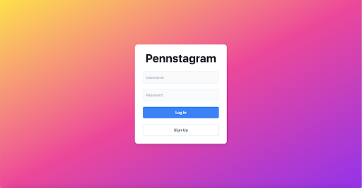
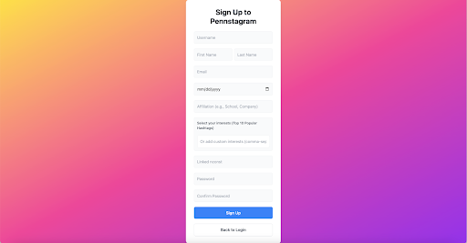
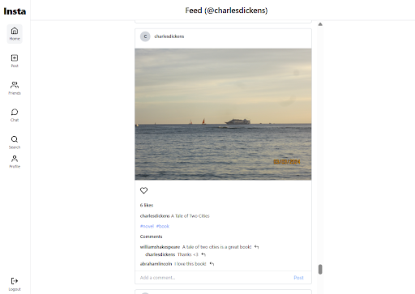
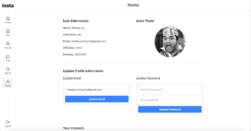
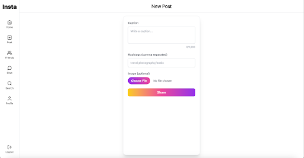
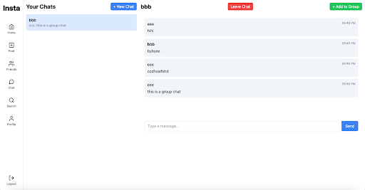

# InstaLite

InstaLite is a full-stack, scalable social media platform inspired by Instagram. Built with React, Node.js, Apache Kafka, and Apache Spark, it supports image-based user profiles, real-time chat, and intelligent post ranking using graph-based machine learning.

---

## 👥 Team
-   Grace Deng: gdeng@seas.upenn.edu
-   Andrew Chang: andrew08@seas.upenn.edu
-   Wesley Liu: wesliu@seas.upenn.edu
-   Daniel Li: dli2004@seas.upenn.edu
---

## 🔧 Overview

### 🖼️ Frontend (React)
- **React + Vite**
- **Socket.io Client** for live chat
- **Infinite scrolling**
- **Image upload** with direct S3 handling via pre-signed URLs
- **Chat UI** with friend detection and message threading

### 🌐 Backend (Node.js + Express)
- **Express.js** REST API server
- **MySQL (RDS or local)** for persistent user/post/chat data
- **Kafka** for scalable message queueing of feed and federated posts
- **ChromaDB** for image and text embedding search
- **S3** integration for static asset storage (user images, post uploads)

### 🧠 Post Recommendation Algorithm (Apache Spark + Adsorption Algorithm)
- **Apache Spark** jobs compute a ranking graph over posts, users, hashtags
- **Livy + EMR** to interface Spark with backend over REST
- Graph includes:
  - User-hashtag, user-friend, user-like, and hashtag-post edges
- **Adsorption algorithm** run hourly to recompute personalized weights
- Ranked posts persisted in MySQL for fast frontend access

### 🔍 Natural Language Search
- **LLM-based RAG (Retrieval-Augmented Generation)** using vector similarity over actors, movies, and posts
- **ChromaDB** to store and query embeddings


### 🧵 Real-time Messaging (Kafka & Socket.io)
- **Kafka topics** handle federated post exchange
- **WebSockets** for user-to-user live chat
- **Message persistence** stored in MySQL

### 🌐 AWS Services
| Service | Purpose |
|--------|--------|
| **EC2** | Hosts backend and frontend apps |
| **RDS (MySQL)** | User/post/chat database |
| **S3** | Publicly accessible post & profile images |
| **EMR + Livy** | Spark cluster for ranking algorithm |
| **Kafka (via EC2 tunnel)** | Federated feed post distribution |

---

## Features

| Feature | Description |
|--------|-------------|
| **Signup/Login** | Secure user auth with salted passwords |
| **Image Embeddings** | Upload selfie → match with 5 closest actors (ChromaDB) |
| **Feed + Infinite Scroll** | Ranked posts from friends, hashtags, federated streams |
| **Post Creation** | Text + image posts with hashtag tagging |
| **WebSockets Chat** | Real-time chat with history and group support |
| **Natural Language Search** | Actor, post, and user discovery via LLM + vector DB |
| **Friends System** | Add/remove friends with online status |
| **Federated Kafka Stream** | Cross-site posts broadcasted and consumed via Kafka |
| **Hourly Spark Ranking** | Graph-based feed curation using Apache Spark |

---

## 📸 Pics







---

## Setup

Instalite is no longer hosted on AWS for cost reasons, but can be demoed locally. 

### 1. Environment Prep

Use `.env.example` as a template for your own `.env` file.

```bash
# Clone the repository
git clone https://github.com/your-username/instalite.git
cd instalite
```

### 2. Frontend

```bash
cd frontend
npm install
npm run dev --host
```

### 3. Backend

```bash
npm install
npm run start
```

### 4. Kafka (Optional)

Since the Kafka stream is no longer being hosted, simply set `KAFKA_ENABLED=false` in the .env file in the home directory.

### 5. ChromaDB

```bash
source setup/chroma_setup.sh

# Run chromadb
source setup/run-chroma.sh
```

### 6. MySQL Database

```bash
cd setup
source install-mysql.sh 

```

Set `DATABASE_SERVER=localhost` in the .env in home directory.

### 7. Spark Jobs (via Livy on EMR)

```bash
# Build Spark JAR
cd spark-jobs
# Enables auto run from server
mvn clean package

# Or run on command
mvn exec:java@local
```

